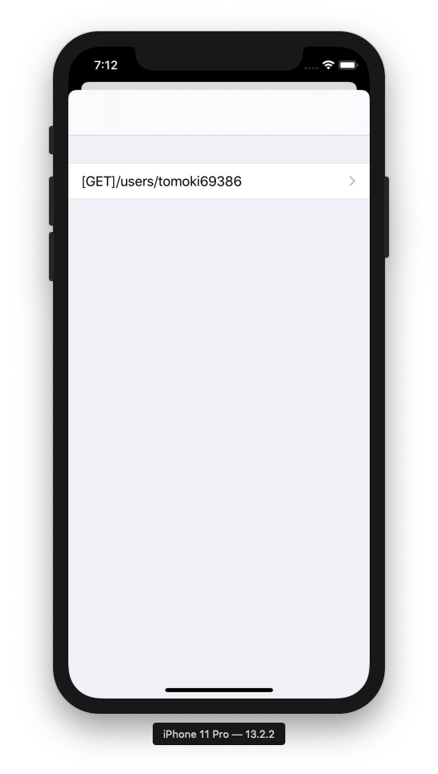
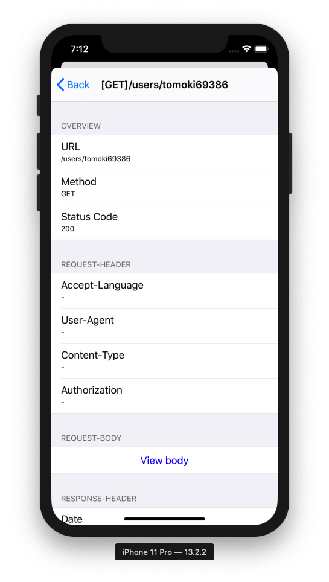
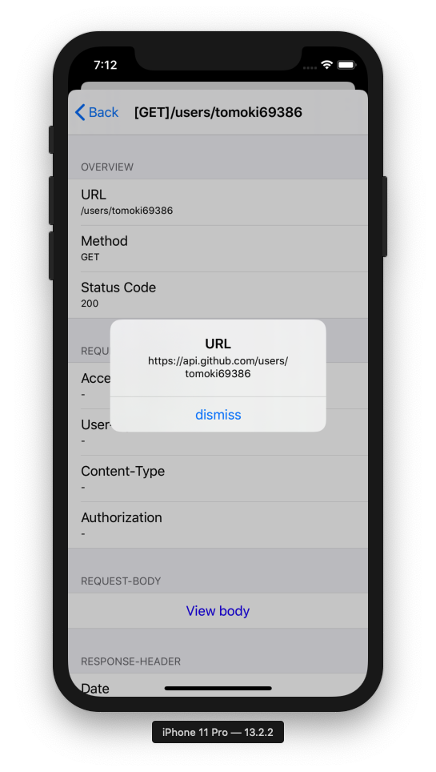
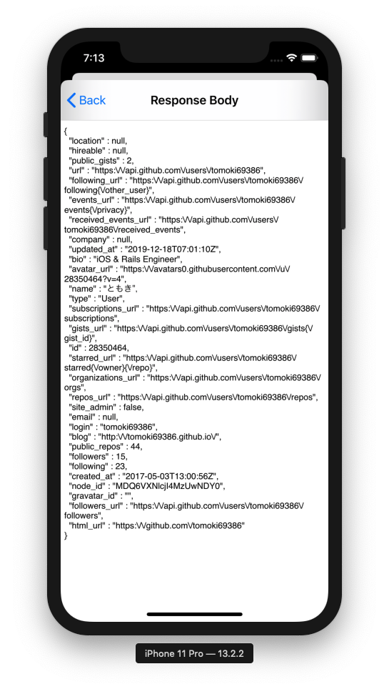

# NetowrkDebugViewer

[](https://github.com/Carthage/Carthage)

Library that provides a view to view API communication information
API通信情報を見れるViewを提供するライブラリ

## Installation


### [Carthage](https://github.com/Carthage/Carthage)

Add this to `Cartfile`

```
github "tomoki69386/NetworkDebugViewer"
```

```bash
$ carthage update
```

# Usage

```swift
let networkDebug = NetworkDebug(response, request: request, data: data)
let viewController = NetworkDebugListViewController([networkDebug])
let navigationController = UINavigationController(rootViewController: viewController)
present(navigationController, animated: true)
```

|  |  |
| :------------------------------------------: | :------------------------------------------: |
|  |  |
